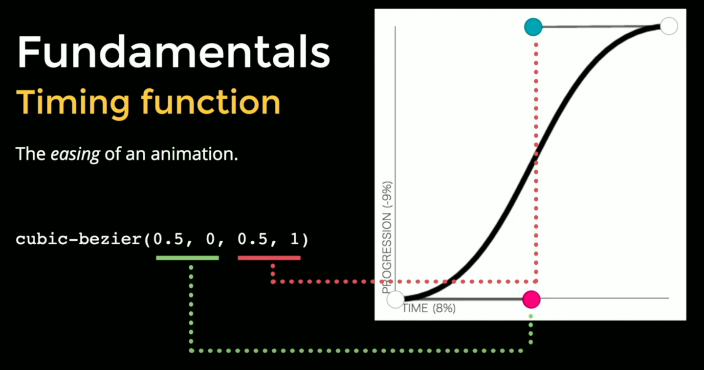

# Lesson 0: Fundamentals

## Animation Fundamentals

- Why animate?

  - Guidance and clarification - Animations tell user what could happen or what did happen
  - Style and branding - Having a consistent feel for animations across an app (can be done with animation primitives) gives user trust and makes app feel consistent

- Duration: how long an _iteration_ of an animation takes to complete.

  - iteration: some animations may be infinite

- Delay: how long it takes before an animation (or transition) _starts_

  - Can be helpful in orchestrating animations (but a delay only happens once, so won't work with multiple iterations)

- Timing function: the _easing_ of an animation

  - How the animation feels, how it accelerates or decelerates over time
  - cubic-bezier(a, b, x, y) - 2 control points: (a, b) is control point for start of curve and x, y is control point for end of curve. These are x/y coordinates.
    

## Animation Easing

## CSS Variables

- CSS Variables: custom properties that can be inherited by elements and set by JavaScript:

```css
:root {
  --duration: 2s;
}

.thing {
  animation-duration: calc(var(--duration, 1s));
}
```

```js
const thingEl = document.querySelector(".thing");

thingEl.style.setProperty("--color", "green");
```

## What to Animate

## Resources

- [Ground Rules for CSS Animations](https://css-tricks.com/ground-rules-for-web-animations/)
- [UX Animation Principles: Duration](https://codepen.io/team/keyframers/pen/gdJJZV)
- [UX Animation Principles: Stagger](https://codepen.io/team/keyframers/pen/GXaaNw)
- [UX Animation Principles: Acceleration](https://codepen.io/team/keyframers/pen/ZqbWao)
